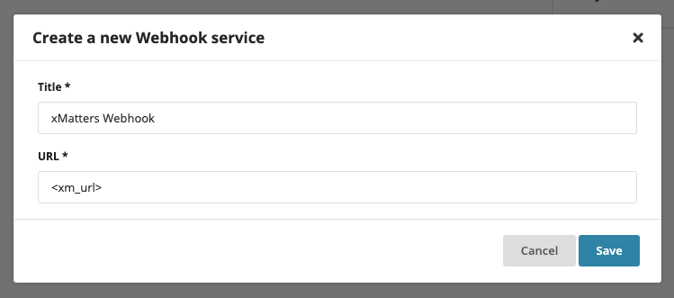

# SolarWinds AppOptics

This integration allows you to alert xMatters from AppOptics.

---------

<kbd>
  
</kbd>

---------

# Files

* [AppOptics.zip](AppOptics.zip) - Workflow zip file with the step and example flow
* [appoptics.png](/appoptics.png) - AppOptics logo

# How it works
When an alert goes off in AppOptics, xMatters is triggered and can send alerts to the right people at the right time.

# Installation

## xMatters Setup
1. Download the [AppOptics.zip](AppOptics.zip) file onto your local computer
2. Navigate to the Workflows tab of your xMatters instance
3. Click Import, and select the zip file you just downloaded
4. Fill in the recipients in the **Create Event** step.
5. Get the URL from the **Inbound from AppOptics** step. This will be used when setting up the AppOptics service.
6. Create an **API Token** constant with a Full Access API Token from AppOptics (see below). This is used in the **AppOptics - Resolve Alert** Step.

## AppOptics Setup

### Get API Token
1. Go [here](https://my.appoptics.com/organization/tokens) to get an API Token.

2. Create a new API Token that has **Full Access** permissions.

3. Put this in the **API Token** constant in xMatters. This will be used in the **AppOptics - Resolve Alert** step.

### Create an AppOptics Alert

1. Create an Alert in AppOptics.

2. Choose conditions for the alert. Click next.

Show Image

<kbd>

</kbd>

3. Add a new service with the **webhook** type.

Show Image

<kbd>

</kbd>

4. Name the webhook and include the Initiation URL from the xMatters HTTP trigger.

Show Image

<kbd>

</kbd>

5. Click next.

6. Enter the final details and enable the alert.

Show Image

<kbd>

</kbd>

# Testing
Click the **Test Fire** button on the alert in AppOptics and see if a message shows up in the xMatters Activity Log on the Flow.

# Troubleshooting
Check that the workflow is enabled. Look in the Activity Log to see details on what is failing.
